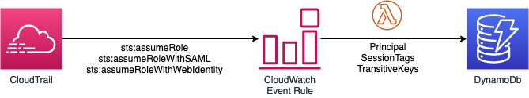

# Tag Inheritance in AWS

This solution tags AWS resources with the tags of principals automatically. 
A tag set is created by merging IAM tags and session tags, which is finally applied to all resources in the triggered
CloudWatch event. 

## Session Tags

Session tags are key-value pair attributes that you pass when you assume an IAM role or federate a user in AWS STS. 
You do this by making an AWS CLI or AWS API request through STS or through your identity provider (IdP).
When you use AWS STS to request temporary security credentials, you generate a session. 
Sessions expire and have credentials, such as an access key pair and a session token.
When you use the session credentials to make a subsequent request, the request context includes the aws:PrincipalTag 
context key. You can use the aws:PrincipalTag key in the Condition element of your policies to allow or deny access 
based on those tags.

When you use temporary credentials to make a request, your principal might include a set of tags. These tags come from the following sources:

1. Session tags – These tags were passed when you assumed the role or federated the user.

2. Incoming transitive session tags – These tags were inherited from a previous session in a role chain. 

3. IAM tags – These tags were attached to the IAM role that you assumed.

However, there is no way to retrieve session-tags and transitive tag keys from the STS session using AWS API at the moment. 
That is why we need to fetch session tags from STS events and store in a database together with the principal 
(user/role ARN) information. 



## Tag Factory

Tag factory consists of a lambda function, which processes the CloudWatch events initially and decides which tag handler 
to invoke using the event source field.

Each tag handler follows these steps in order:

1. Parse  the event data and fetch all resource identifiers. For example, an EC2 event may contains various
resources such as instances, volumes and security groups. 

2. Fetch IAM principal ARN from the event.

3. Call AWS APIs to fetch IAM tags of the principal and add an Owner tag to specify the resource owner principal.

4. Fetch session tags from the database, if exists, for this session (principal ARN + session name).

5. Merge tags to create the final tag-set to apply; session tags overwrites IAM tags if there is a duplicate.

6. Apply the tag set to all the resources.


CloudWatch event rules are setup per service by CDK stacks.

Each rule triggers the lambda function, lambda/tag_handler/tag_handler.py, which then passes event to the Tag Factory for
further processing as described above.


## Deploying the Solution!

This solution is deployed in your default region. The session handler is also deployed to us-east-1 as it hosts the global
STS endpoint. STS:AssumeRole* events are handled by this region and the tags are stored in your default region.
```
python3 -m venv .env`
```

```
$ source .env/bin/activate
```

If you are a Windows platform, you would activate the virtualenv like this:

```
% .env\Scripts\activate.bat
```

Once the virtualenv is activated, you can install the required dependencies.

```
$ pip install -r requirements.txt
```

At this point you can now synthesize the CloudFormation template for this code.

```
$ cdk synth
```

If the previous step is successful, you can deploy this stack to your default AWS account/region.

```
$ cdk deploy aws-session-stack aws-tags-stack us aws-session-stack-us [--profile <AWS-PROFILE>] [--region <override-default-region>]
```

To add additional dependencies, for example other CDK libraries, just add
them to your `setup.py` file and rerun the `pip install -r requirements.txt`
command.

### Useful commands

 * `cdk ls`          list all stacks in the app
 * `cdk synth`       emits the synthesized CloudFormation template
 * `cdk diff`        compare deployed stack with current state
 * `cdk docs`        open CDK documentation
 

 
 
